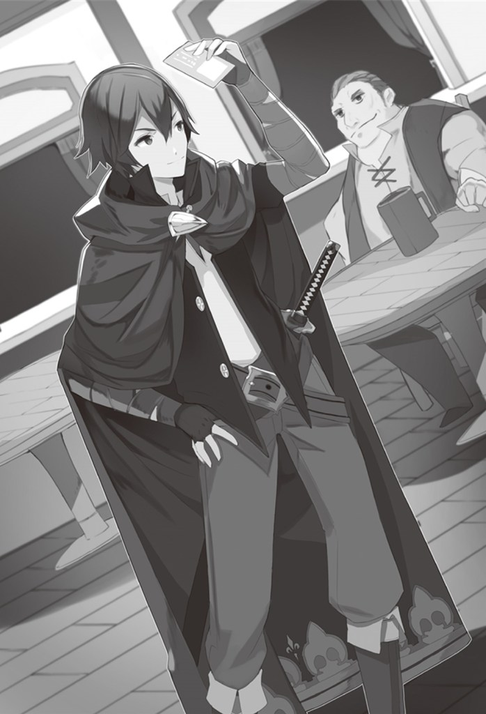

# Chương 6 – Yêu cầu đầu tiên của tôi

Sáng hôm sau, tôi đến hội mạo hiểm giả theo chỉ dẫn của Dass.

Tôi mở cửa giống như ngày hôm trước, nhưng vừa bước vào đã cảm nhận được ánh mắt của tất cả mọi người trong phòng đổ dồn về phía mình.

Hả? Sao vậy? Tôi đã làm gì à?

Hơi lúng túng, tôi đến gặp nhân viên tiếp tân Neena để nhờ giúp đỡ.

"Có chuyện gì vậy?"

Neena nhìn tôi, thở dài, rồi đáp lại.

"Nếu có ai đó đến đăng ký làm mạo hiểm giả mà quật sạch ba mạo hiểm giả hạng B, thì ai cũng sẽ tò mò chứ, đúng không? Mà anh ấy còn bắt đầu ở hạng B nữa."

Tôi nghĩ rằng dù vậy thì cũng quá chú ý rồi…nhưng Neena gác chủ đề này sang một bên và đặt một tấm thẻ bạc lên quầy.

"Đây là thẻ mạo hiểm giả của anh. Nó có chức năng như giấy tờ tùy thân và nếu trình nó ở cửa hàng vũ khí hay áo giáp, anh cũng sẽ được giảm giá. Nếu cần cấp lại, anh sẽ phải trả năm đồng bạc lớn, nên hãy cẩn thận…cuối cùng, anh phải nhỏ vài giọt máu lên phần này. Việc này sẽ ràng buộc tấm thẻ với chủ nhân của nó."

Tôi dùng con dao Neena đưa cho khẽ rạch đầu ngón tay và để máu nhỏ lên tấm thẻ.

Khi tôi làm vậy, tấm thẻ phát sáng trong giây lát.

"...vậy là quá trình đăng ký hoàn tất. Xin chúc mừng. À, hội trưởng gọi anh, nên hãy đến văn phòng của ông ấy."

Neena mỉm cười ấm áp và đưa tôi tấm thẻ.

Tôi nhận lấy và lập tức đi đến văn phòng hội trưởng.

Tôi gõ cửa rồi bước vào phòng, thấy Dass đang bị chôn trong đống tài liệu.

"Xin chào, cảm ơn cậu đã đến. Xin lỗi, cậu ngồi xuống đợi một chút được không? Ta sắp xong rồi."

Tôi làm theo lời dặn và ngồi xuống ghế sofa. Ngay sau đó, Dass đặt bút xuống và ngồi vào ghế sofa đối diện tôi.

"Lý do ta mời cậu đến hôm nay là để thăng cậu lên hạng A."

Hả? Tôi mới đăng ký hạng B hôm qua thôi mà?

"Chẳng phải nhanh quá sao?"

Tôi bày tỏ sự bối rối và Dass gật đầu.

"Đúng vậy, đó là tốc độ chưa từng có tiền lệ. Nhưng dựa trên năng lực của cậu, ta không nghĩ là không xứng đáng. Tất nhiên, đó không phải là lý do duy nhất…"

"Có phải là hội đang thiếu mạo hiểm giả cao cấp không?"

Tôi nêu một ý tưởng chợt nảy ra trong đầu và Dass cười khổ.

"Hahaha…thực ra đúng là vậy. Hội đã đi đến kết luận rằng không thể để tuột một người có năng lực như cậu…nên như một ngoại lệ đặc biệt, chúng tôi dự định thăng cậu lên hạng A."

"Tôi hiểu. Nhưng việc lên hạng cao hơn có dễ vậy không?"

Tôi hỏi vì sẽ là vấn đề nếu thủ tục mất nhiều thời gian. Dass chống cằm, trầm ngâm.

"Để ta nghĩ…để được thăng lên hạng A, thực ra cậu cần giấy giới thiệu của hai hội trưởng. Ta sẽ giải thích tình hình với một hội trưởng quen biết và nhờ họ viết thư giới thiệu, nên có lẽ sẽ mất khoảng một tuần…cậu định rời thị trấn à?"

Tôi đáp rằng đúng là tôi dự định rời thị trấn trong ngày hôm đó, hướng đến Vaana và vượt biên sang vương quốc Perdis.

Dass sau đó bảo tôi chờ một chút, viết gì đó lên một mảnh giấy rồi đưa cho tôi.

"Hãy trình thư giới thiệu này cho hội trưởng ở Vaana. Nếu cậu làm vậy, họ sẽ cấp thẻ cho cậu ngay tại chỗ."

Bối rối, tôi yêu cầu Dass giải thích thêm.

"Việc cấp thẻ dễ thế thôi sao?"

"Ừ, ta sẽ gửi ngựa thư để thông báo cho họ về tình hình. Theo quy định của hội, cậu phải tự mang theo thư giới thiệu, nên ta sẽ nhờ họ xử lý các thủ tục cần thiết khác. Nếu cậu đưa thư giới thiệu, họ sẽ cấp thẻ ngay."

"Tôi hiểu, khá là hiệu quả."

Bị thuyết phục, tôi cảm ơn Dass và chuẩn bị rời đi.

Tôi quay lưng lại với Dass và định bước ra, thì ông ấy gọi với theo.

"À tiện thể, dạo gần đây trên đường đến Vaana có ngày càng nhiều vụ cướp. Có lẽ cậu sẽ không sao, nhưng hãy cảnh giác."

"Tôi hiểu, cảm ơn ông đã cảnh báo."

Tôi cảm ơn Dass thêm lần nữa và rời khỏi văn phòng hội trưởng.

…Ồ phải, nếu có yêu cầu hộ tống đi Vaana, thì tôi nhận luôn cũng được.

Tôi nghĩ vậy khi quay lại đại sảnh.

Neena vẫn ở quầy, nên tôi hỏi chị ấy về yêu cầu và chị ấy lập tức hành động.

"—xin chờ một chút. Nếu có yêu cầu hộ tống đi Vaana, em sẽ tìm ngay."

Tôi ngồi xuống ghế cạnh quầy để chờ, mắt nhìn đâu đâu, nhưng những mạo hiểm giả đã chứng kiến vụ ẩu đả của tôi với ba tên hạng C ngày hôm trước lần lượt đến trò chuyện với tôi.

Hầu hết họ cảm ơn tôi vì đã cho họ tiền uống rượu, nói rằng họ vui nhất trong một thời gian dài. Tôi thấy khá là dễ chịu.

Vài phút sau, Neena quay lại quầy.

"anh Haruto, em tìm thấy yêu cầu phù hợp với yêu cầu của anh. Đó là hộ tống một đoàn thương nhân, và họ sắp khởi hành. Yêu cầu cần bốn người, và họ đã có ba…anh có nhận không?"

"Vâng, cảm ơn, tôi nhận…tôi cũng biết ơn vì mọi thứ chị đã làm cho tôi, chị Neena."

Tôi tranh thủ nói lời cảm ơn với Neena, người đỏ mặt và mỉm cười.

"Không có gì. Hẹn gặp lại."

~

Tôi được cho biết rằng trình thẻ mạo hiểm giả cho hội khi đến Vaana sẽ đánh dấu yêu cầu hoàn thành, nên tôi đi thẳng đến điểm hẹn.

Tôi đã cất toàn bộ hành lý vào không gian lưu trữ từ sáng, trước khi rời chỗ trọ, nên trên người tôi cũng chẳng còn gì nhiều.

Tôi nhanh chóng đến điểm hẹn và thấy hai cỗ xe ngựa, với Bacchus đứng cạnh chúng.

"Ồ? Vậy yêu cầu này là từ anh sao, anh Bacchus?"

Bacchus nghe tiếng tôi gọi và bước về phía tôi, mỉm cười.

"Ồ, vậy anh cũng nhận yêu cầu của tôi à, anh Haruto. Thật đáng yên tâm. Chúng tôi đang vất vả tìm thêm một người, anh thấy đó."

Tôi đã quên mất, nhưng Bacchus có nói với tôi rằng họ cũng sẽ đi Vaana.

Lúc đó tôi nghe thấy giọng nói từ phía sau.

"Anh là người cuối cùng à?"

Tôi quay lại và thấy một nhóm ba người đàn ông trông dữ tợn.

Hơi cảnh giác với họ, tôi đáp "đúng vậy".

Tôi bắt đầu tự hỏi họ là loại người gì, liệu họ có gây sự với tôi theo kiểu "kinh điển" như mấy người hôm trước không, thì—

"Tuyệt quá! Anh giúp ích lắm thật sự!"

"Chỉ có ba chúng tôi thì hơi khó khăn, anh thấy mà."

"Đúng, anh là cứu tinh của tụi tôi."

Họ thân thiện hơn nhiều so với dự kiến.

Mặc dù trông thô ráp, nhưng thực ra đây là những người khá tốt!

Tôi đang nghĩ vậy thì tên thủ lĩnh thô ráp của nhóm hỏi tôi một câu.

"Chúng tôi là một tổ đội hạng C, có thể hỏi anh hạng gì không?"

"Tất nhiên, tôi hạng B…dù tôi mới đăng ký hôm qua."

Tôi đưa thẻ mạo hiểm giả ra làm bằng chứng và ba mạo hiểm giả đứng đơ tại chỗ, mắt mở to, rồi bắt đầu hỏi tôi hàng loạt câu hỏi.

"Anh mới đăng ký hôm qua mà đã là hạng B rồi…hay là anh là người mà mọi người đang bàn tán?"

"Ôi, tin đồn là thật à!? Nhưng ít ra chúng ta biết yêu cầu này chắc chắn sẽ thuận lợi!"

"Đúng, tụi tôi kỳ vọng anh lắm đó! Mà anh tên gì nhỉ? …khoan, để tụi tôi tự giới thiệu trước đã. Tôi tên Barnar, kiếm sĩ. Hai người này là Norkas, kiếm sĩ như tôi, và tên cầm giáo Oorde."

Tôi hiểu rồi, vậy thủ lĩnh nhóm chắc là gã trông thô ráp này, Barnar. Gã lùn là Norkas và gã cao là Oorde.

"Tôi tên Haruto, rất vui được gặp."

"Vâng, tôi cũng vậy…à mà, lối chiến đấu của anh là gì vậy, Haruto? Hình như anh không mang kiếm, anh là pháp sư à?"

Tên thủ lĩnh hỏi tôi với giọng bối rối, nhưng tôi cười và đáp lại.

"Để tôi giải thích khi ra khỏi thị trấn, anh sẽ thấy thú vị cho mà xem."

Barnar nghiêng đầu sang một bên, càng thêm bối rối trước lời tôi.

~

Chúng tôi khởi hành ngay sau đó: xe ngựa chạy nhanh, thị trấn dần nhỏ lại phía sau. Chúng tôi lên hai cỗ xe theo cặp: tôi và Barnar trong một, Norkas và Oorde trong cỗ còn lại.

Một lúc sau, hình như Barnar không kìm nổi nữa nên lại hỏi tôi câu đó.

"Thôi nào Haruto, giờ anh có thể nói cho tôi cách anh chiến đấu rồi chứ?"

"Được thôi…"

Tôi trả lời câu hỏi của Barnar bằng cách rút kiếm ra từ không gian lưu trữ.

"Cái gì!? À, một chiếc túi phép thuật…ghen tị thật. Nhưng anh nên để kiếm lộ ra ngoài thị trấn, nếu không người ta sẽ nghĩ anh là mồi ngon."

Tôi thành thật gật đầu trước lời cảnh báo của Barnar. Dù sao anh ấy cũng có kinh nghiệm hơn tôi với tư cách một mạo hiểm giả.

"Vậy anh là kiếm sĩ à, Haruto?"

Tôi nhẹ nhàng lắc đầu, rồi đưa tay ra ngoài xe.

Barnar nhìn tôi đầy tò mò khi tôi dùng Không Đọc thi triển một phép phong cấp thấp, Cầu Gió, bắn vào một tảng đá hơi xa đường.

Quả cầu gió bay thẳng vào tảng đá, thổi tung các mảnh vỡ khắp nơi.

"Cái gì vậy!?"

"Cầu Gió."

"Một phép cấp Cơ Bản mà uy lực thế này!? Dễ dàng đạt cấp Trung rồi!! Nhưng quan trọng hơn, anh dùng được Không Đọc á!?"

"Ừ, thì…dù sao, ý tôi là tôi chiến đấu bằng cả kiếm và phép thuật."

Barnar nhìn tôi như thể không thể tin nổi vào mắt mình.

~

Sau thêm vài giờ di chuyển và ăn trưa, kỹ năng Phát Hiện Sự Hiện Diện của tôi phát hiện điều gì đó.

Tôi kiểm tra bản đồ và thấy hơn 20 sự hiện diện trên đường đi của xe ngựa.

Dass đã nói rằng cướp thường xuất hiện quanh đây mà, đúng không…

Tổ đội của Barnar là hạng C, nên họ có thể sẽ gặp khó khăn khi đối phó với nhiều đối thủ như vậy.

Tôi báo cho Bacchus, người đánh xe và nhóm của Barnar biết về sự hiện diện của con người phía trước, để họ cảnh giác.

Sau khi chúng tôi đi thêm một đoạn, những sự hiện diện hiển thị trên bản đồ nhảy ra ngoài ánh sáng.

"Dừng xe lại, ngay!! Bỏ lại hành lý rồi cút đi. Nếu không, mấy người cũng sẽ mất mạng, hiểu chưa?"

Gã đàn ông dẫn đầu nhóm, có lẽ là thủ lĩnh, quát lệnh.

Họ thực sự là cướp, rốt cuộc.

Tôi và nhóm của Barnar nhanh chóng xuống xe và đi về phía bọn cướp.

"Damn, có đến 20 tên…"

Giọng Barnar phản bội sự lo lắng của anh ấy, nhưng tôi đáp lại bình tĩnh.

"Không, thực ra là 25 đấy. Có 2 tên ẩn trong bụi cây ở đó và 2 tên nữa trong đám cỏ cao ở kia. Tên cuối cùng trốn sau cái cây đó."

Nghe tôi chỉ điểm chính xác đồng bọn đang ẩn nấp của hắn, những người không thể nào nhìn thấy từ vị trí của chúng tôi, thủ lĩnh cướp không khỏi bày tỏ sự ngạc nhiên.

"L-làm sao mày biết!?"

"Sự hiện diện của chúng rõ mồn một."

Tôi cười khẩy khi đáp lại và mấy tên cướp đang ẩn nấp cũng lò dò bước ra, lộ rõ vẻ bực bội, rồi tiến đến chỗ thủ lĩnh.

"Tch…!! Nhưng bọn tao áp đảo về số lượng!! Mày sẽ không thể vênh mặt được lâu đâu!!"

Đúng như thủ lĩnh nói, số lượng của chúng vượt trội hơn chúng tôi rất nhiều.

Barnar và những người khác cũng trông có vẻ lo lắng.

"Chúng quá đông…dù có Haruto ở phía mình, tỷ lệ thắng của chúng ta trông tuyệt vọng."

Barnar và đồng đội đã chuẩn bị sẵn vũ khí, nhưng trông có vẻ bị áp đảo và chưa sẵn sàng để thực sự chiến đấu.

"Một mình tôi xử lý được, đừng lo. Dù sao đây cũng là cơ hội tốt cho trận chiến thực sự đầu tiên của tôi với con người. Barnar, mấy anh, xin hãy canh gác xe ngựa."

Nhóm của Barnar phản ứng đầy không tin trước lời tôi, trong khi bọn cướp phá lên cười khiếm nhã.

"Thật hả? Tao nghe nhầm à? Thằng nhóc như mày định đánh với tất cả bọn tao à? Mà đây cũng là trận chiến thực sự đầu tiên của mày với người nữa!? Mày định làm tụi tao cười đến chết à."

Tôi, tuy nhiên, cười gằn khiêu khích thêm.

"Ừ, tao nghĩ nó sẽ là chuyện nhỏ thôi. Và không phải *tất cả bọn mày*, mà chỉ *mày thôi*, hiểu chưa?"

Lời tôi nói khiến bọn cướp gần như nổi cơn tam bành một cách lố bịch.

"Mày nói cái gì vậy!?…Tao nghe đủ rồi!! Xé xác thằng nhóc này đi!!"

Theo lệnh của tên thủ lĩnh đang nổi điên, đám tay sai rút kiếm. Barnar và đồng đội cuối cùng lấy lại bình tĩnh và hét với tôi.

"Này, Haruto!! Anh không thể nào một mình chống lại tất cả bọn chúng được, đúng không!?"

"Đây là trận chiến thực sự đầu tiên của anh với đối thủ là người, đúng không? Không cần phải gắng quá đâu!"

"Chúng tôi sẽ chiến đấu cùng anh!! Hãy đổi ý khi vẫn còn có thể!"

Khi những giọng nói ấy vọng đến tai tôi, tôi bước về phía bọn cướp.

Tôi vui vì Barnar và những người khác đã nghĩ như vậy, nhưng họ có thể sẽ cản đường tôi và tôi không muốn họ bị thương.

"Tôi ổn, để tôi lo."

Rồi tôi rút kiếm.

Tuy nhiên, tôi không vào thế cụ thể nào — chỉ để nó buông thõng bên tay phải.

Có lẽ trông như thể tôi đang lười biếng hay cẩu thả.

Nhưng đó thực sự là một thế kiếm, chỉ khả thi với những ai đã thành thạo kiếm thuật, "Thế Hư Vô".

Bọn cướp chắc hẳn nghĩ tôi đang khinh chúng, nên chúng xông vào tôi, tru tréo giận dữ hơn trước.

Đợt tấn công đầu tiên đến từ ba tên cướp.

Tôi né nhát chém của chúng trong tích tắc cuối cùng và phản đòn bằng cách chém vào cổ chúng.

Tôi cảm nhận được cảm giác xuyên qua da thịt, nhưng không cảm thấy áy náy hay ghê tởm về việc giết người khác.

Khi tôi suýt bị giết bởi lũ hiệp sĩ và nhận được sức mạnh mới, tôi đã quyết không nương tay với kẻ thù.

Với lời thề này trong lòng, tôi không hề do dự khi giết những kẻ tấn công tôi với ý định sát hại.

Khi ba tên cướp đổ gục xuống đất, tôi vung kiếm hất sạch máu.

"Damn it!! Mấy đứa đứng đó làm gì vậy!? Vây quanh thằng nhóc rồi giết nó!!"

Tên thủ lĩnh, bị sốc trước cảnh ba tên tay sai ngã gục cùng lúc, ra lệnh cho đám tay sai vây quanh tôi và lập tức được tuân theo.

Tổng cộng chúng hơn 20 tên.

Nếu nhiều người tấn công tôi cùng lúc như vậy, lưỡi kiếm sẽ đụng nhau vài lần, tôi nghĩ, nên tôi lo rằng kiếm mình sẽ gãy, nhưng…

Ồ phải, tôi chỉ cần tăng độ bền của kiếm.

Tôi nhanh chóng tạo một kỹ năng phù hợp với Toàn Năng.

<<Kỹ năng "Phù Phép" đã có được. Cấp kỹ năng đạt 10. Kỹ năng được thêm vào Hợp Nhất Phép Thuật.>>

Phù Phép là một loại phép thuật có thể gắn các hiệu ứng đặc biệt lên đồ vật, v.v.

Hiệu ứng tôi sẽ gắn lần này là "Lưỡi Bền". Nó tăng độ sắc bén và độ bền của kiếm và katana.

Thực ra tôi muốn gắn nhiều hiệu ứng khác nữa, nhưng số hiệu ứng có thể gắn lên vũ khí tùy thuộc vào độ hiếm và độ bền của nó.

Thanh kiếm tôi đang sử dụng chỉ có thể chứa tối đa một hiệu ứng.

Ngay khi phù phép hoàn tất, 22 tên cướp tấn công tôi cùng lúc.

Tôi phớt lờ mấy tên tấn công từ phía sau và lao thẳng vào những tên phía trước.

Bọn cướp phía trước tôi cố dùng kiếm chắn, nhưng tôi vẫn quét sạch chúng.

Tích tắc sau, lưỡi kiếm của tôi đã chẻ đôi bọn cướp, tính luôn cả kiếm của chúng.

Tôi phá vòng vây xong, nhưng vẫn còn bọn cướp phải xử lý, tấn công tôi từ phía sau những tên tôi đã hạ.

Tôi lại bị vây: tôi đợi bọn cướp đến đủ gần, rồi kích hoạt phép phong cấp thấp Kiếm Gió, tạo ra một lưỡi gió.

Tuy nhiên, tôi không phóng nó ra ngay, mà giữ nó quấn quanh kiếm và chờ.

Rồi tôi hình dung nó tỏa ra theo chuyển động tròn và thực hiện một vòng xoay toàn thân trong khi vung kiếm.

"Cái gì!?"

Bọn cướp phản ứng đầy sốc khi lưỡi gió tỏa ra thành vòng tròn, đúng như tôi hình dung.

Phép thuật được bắn ra với tốc độ tương đương nhát chém của tôi, gặt sạch sinh mệnh của hơn 10 tên cướp trong một nhát.

Hài lòng vì phép thuật hoạt động đúng như mình tưởng tượng, tôi bắt đầu bước về phía tên thủ lĩnh cướp.

"M-mày…mày là quái vật!!"

Tên thủ lĩnh, kêu lên thảm hại, ngã ngồi xuống và tuyệt vọng bò trốn khỏi tôi.

Số cướp còn sống sót khác chỉ còn khoảng tám. Chúng chặn đường tôi, trung thành bảo vệ thủ lĩnh, nhưng chân chúng run rẩy.

"M-mày sẽ không đến gần sếp tao được nữa đâu!!"

Tôi thầm nghĩ, tên thủ lĩnh cướp lại truyền cảm hứng cho lòng trung thành bất ngờ.

Tôi đang cân nhắc suy nghĩ ấy, ấn tượng, thì tám tên cướp xông vào tôi.

Tôi né từng đòn tấn công của chúng, lần lượt hạ gục từng tên.

Sau khi tất cả tay sai chết, thủ lĩnh bắt đầu cầu xin tha mạng.

"L-làm ơn!! Tha cho tôi!! Tôi không muốn chết!!"

"Hả? Anh đã cố giết chúng tôi, nhưng giờ lại nói anh không muốn chết? Khá là ích kỷ đấy, anh không nghĩ vậy sao? Còn mấy tên thuộc hạ đã chết thì sao?"

"T-thì…"

Tên thủ lĩnh không nói thêm lời nào.

Tôi nên giải quyết luôn hắn.

Tôi nghĩ vậy khi giơ kiếm lên để kết liễu, nhưng Barnar ngăn tôi lại.

"Này, Haruto. Cậu đã làm đủ rồi."

"Barnar, thằng này đã cố giết chúng ta mà."

"Đúng là vậy, nhưng…nhìn cảnh tàn sát này đi, ai cũng sẽ cố ngăn cậu lại."

Tôi nhìn xung quanh: nó giống như một biển máu.

Tôi không cảm thấy tội lỗi về việc giết người, nhưng tôi cũng không phải là fan của cảnh đẫm máu.

Cái này thấy hơi buồn nôn…tôi vừa nghĩ, thì nghe thấy giọng robot quen thuộc.

<<Kỹ năng "Bền Bỉ Tinh Thần" đã có được. Cấp kỹ năng đạt 10. Kỹ năng được thêm vào Hợp Nhất Phép Thuật.>>

Khi giọng nói ấy tắt đi, tôi cũng cảm thấy dễ chịu hơn nhiều.

Toàn Năng lại tự tạo thêm một kỹ năng cho tôi.

Kỹ năng này thực sự hữu ích vượt mức…

Nó cũng giúp tôi lấy lại bình tĩnh đôi chút.

"...Có lẽ tôi thực sự đã quá tay rồi. Xin lỗi, Barnar…nhưng tôi muốn anh để mặc tên này cho tôi."

"H-này…cậu sẽ giết hắn dù sao chứ?"

"Không, tôi sẽ không giết."

Barnar có vẻ nhẹ nhõm khi nghe câu trả lời của tôi.

"—thế nhưng, hắn sẽ phải chịu khổ sở đấy."

Barnar và đồng đội nhìn nhau, mặt cứng đờ.

~

Sau khi tôi đấm vào bụng tên thủ lĩnh cướp và làm hắn bất tỉnh, tôi bắt đầu dọn dẹp xung quanh.

Tôi dùng phép thổ để gom xác chết, các bộ phận văng tung tóe và mặt đất ngập máu, rồi chôn chúng ở bên đường. Tôi san phẳng mặt đất sau đó, tất nhiên rồi.

Sau khi xong tôi đào thêm một cái hố khác và chôn tên thủ lĩnh cướp vào đó, chỉ để mặt hắn lộ ra ngoài.

Cạnh đó, tôi cắm một tấm biển ghi: "Ta là thủ lĩnh của bọn cướp đã hoành hành khu vực này".

Nhóm của Barnar — người đã chứng kiến mọi thứ tôi làm — và Bacchus, người xuống xe từ nửa đường, nhìn tôi đầy không tin.

"Eh? Có chuyện gì vậy? Chôn hắn là quá đáng à? Có lẽ tôi nên treo hắn lên cây…"

"Không không không, thế là quá đủ rồi! Thật sự!"

Bacchus ngắt lời và không để tôi nói hết câu.

Tôi không thấy vấn đề gì và nghiêng đầu sang một bên, nhưng Barnar và những người khác thở dài bất lực.

~

Một lúc sau, chúng tôi lại lên xe ngựa và tiếp tục hành trình đến Vaana.

Chúng tôi lặng lẽ bị xe lắc lư một thời gian, rồi Barnar lên tiếng với tôi như vừa nhớ ra điều gì đó.

"À phải, Haruto…phong thuật lúc nãy là gì vậy? Tôi chưa từng thấy thứ gì như thế."

Hm? Ồ, cái vòng tròn ấy hả, chắc là vậy.

"Nó là một biến thể của Kiếm Gió, về cơ bản. Bằng cách phóng nó theo chuyển động tròn, anh có thể biến nó thành đòn tấn công lan ra mọi hướng. Sức mạnh tấn công và tầm thay đổi tùy theo lượng ma lực sử dụng, nhưng…ừ, thử lần đầu mà cũng tạm ổn rồi, tôi đoán vậy."

Barnar lại một lần nữa sững sờ trước câu trả lời của tôi.

"Anh tạo ra một phép thuật ngay lần thử đầu!? À mà…nó trông như kích hoạt khi kẻ thù khá gần, vậy nó cần nhiều ma lực để thi triển không?"

"Không hẳn, cũng ngang một Kiếm Gió bình thường thôi. Thực ra tôi còn *giữ khá nhẹ*, nếu tôi bơm thêm ma lực, lưỡi chém sẽ ảnh hưởng phạm vi rộng hơn…và tôi đã không *tạo* phép, chỉ *chỉnh sửa* nó một chút."

"...Một phép mạnh như thế mà *giữ khá nhẹ*…? Cậu thật sự là một hiện tượng khác thường…"

Barnar nhìn tôi như thể tôi là người ngoài hành tinh hay một hiện tượng siêu nhiên.

Đừng nhìn tôi kiểu đó, vì Chúa, làm ơn…

---

[←Trước](https://web.archive.org/web/20241113083850//twem-vol-1-chapter-5/) | [Tiếp→](https://web.archive.org/web/20241113083850//twem-vol-1-chapter-7/)
